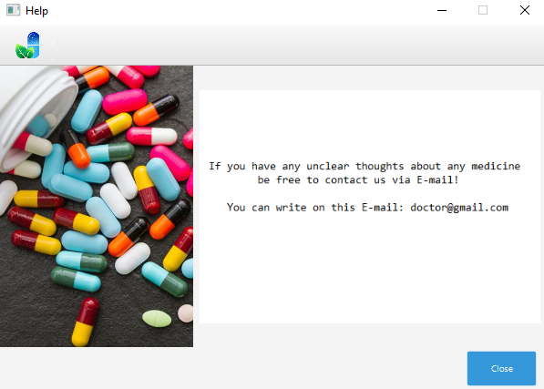

# Online Pharmacy Semina 

This JavaFX application, created with Maven is designed to allow users to easily search for medicines.
This application is an online drug store.
We offer a qualitative selection of  pharmaceutical  products recognized for their naturalness and their organic european certifications.
# Features
- Login and registration for users
- Connection to database
# User Panel
The user panel provides users with all the information they need to search for their medicines, including:
 - Name of the medicine
 - Price of the medicine
 - Quantity of the medicine
 - Description of the medicine

# Getting started
To run this app, download a repository and ensure you have installed the following systems:
- Maven
- JDK 17
- MySQL

1. Clone the repository to your local machine by running the following command in your command line:
```bash
git clone https://github.com/smuratovic3/rpr_projekat.git
```
2. Open the project in IntelliJ IDEA
3. In the project structure, navigate to the "src" directory and open the Main class.
4. Run the Main class by clicking the green play button or by pressing Shift+F10

You should now see the Online pharmacy Semina app open on your screen.


## Built With
- Intellij IDEA
- Scene Builder
- MySQL Workbench


## Contact
Have any questions or feedback? Feel free to reach out to us at smuratovic3@etf.unsa.ba <br>
Thank you for choosing Online Pharmacy Semina for your medication. We're confident that you'll love our app! 🌟

## Screenshots
Online Pharmacy Semina screenshots

### Home Page


### Login Page


### Registration Page


### About us Page


### Help Page


### Page when user is logged in

